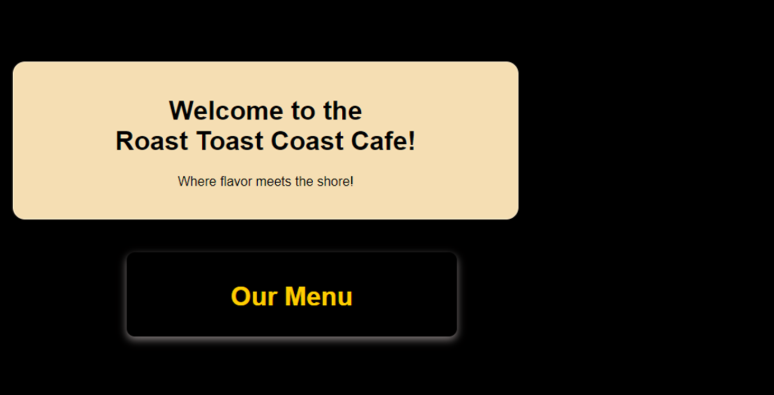
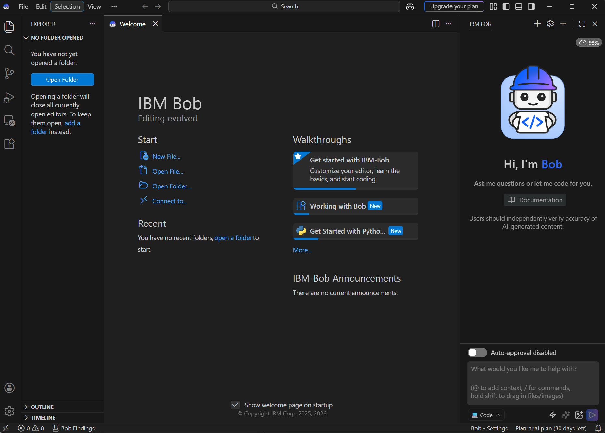
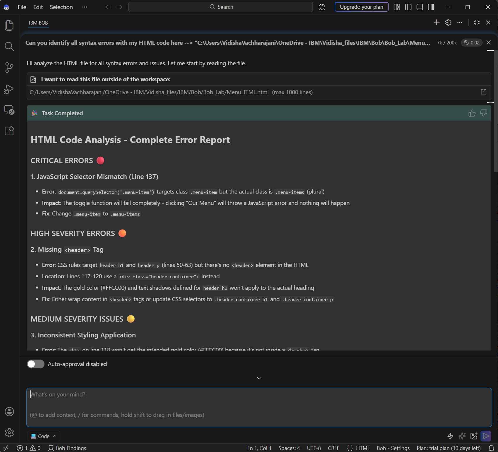
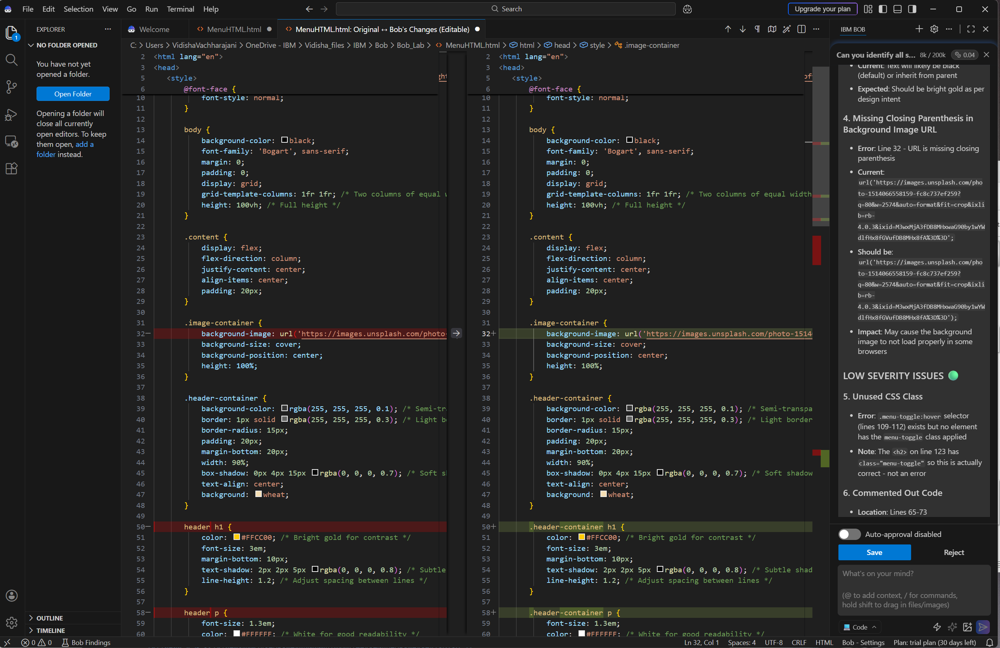

# Use IBM Bob to Troubleshoot and Correct Code in VS Code

## Overview

In this lab, you use **IBM Bob** in **Code mode** within Visual Studio Code (VS Code) to identify, analyze, and correct errors in a web page written in HTML, CSS, and JavaScript. You work through a realistic troubleshooting scenario and practice writing effective prompts that guide IBM Bob to produce precise, actionable outputs.

By completing this lab, you gain hands‑on experience using an AI‑infused development assistant to support code review, error analysis, and revision.

## Learning objectives

After completing this lab, you can:

*   Use **IBM Bob** in **Code mode** to analyze source code for syntax and functional errors.
*   Write structured prompts to guide code troubleshooting and error classification.
*   Review AI‑generated recommendations and apply proposed fixes to existing code.
*   Compare original and corrected code to understand how specific changes resolve errors.

## Contents

- [Task 1: Context](#task01)
- [Task 2: Prompt **IBM Bob** to troubleshoot coding errors](#task02)
- [Task 3: Prompt **IBM Bob** to re-write your code correctly](#task03)
- [Task 4: Reflect on how the correct code differs from the original one](#task04)

***

[Back to the top](#top)

## Task 1: Review the scenario and problem context 

### Background

You run a fictional business called **Roast Toast Coast Café**. To attract new customers, you create a simple website that includes:

*   A welcome message
*   A short tagline
*   An image
*   A button labeled **Our Menu** that reveals menu items when selected

You write the initial version of the site yourself using basic HTML, CSS, and JavaScript.

### Observed issues

When you preview the page in a browser, the output is not as expected:

*   The image does not display.
*   Selecting **Our Menu** does not reveal the menu items.

These issues reduce both the usability and visual clarity of the page.

### Your goal

Your goal is to identify and correct all errors that prevent the page from rendering and functioning as intended. Instead of troubleshooting manually, you use **IBM Bob** in VS Code to assist with code analysis and correction.

***

[Back to the top](#top)

## Task 2: Analyze the code with IBM Bob 

In this task, you guide IBM Bob to perform a structured review of your HTML file and identify issues by type and severity.

### Task 2a: Install and access IBM Bob in VS Code

Complete the following steps to prepare your environment:

1.  Open **Visual Studio Code**.
2.  Ensure that **IBM Bob** is installed and available in VS Code (see [installation notes](#install)).
3.  Launch **IBM Bob**, and wait for the side panel to finish loading.
4.  Select **Open File**, navigate to your HTML file, and open it in the editor.

You now see your source code in VS Code, with IBM Bob available alongside it.

Installation notes: 
- Make sure you have VS Code installed, see <a href="https://code.visualstudio.com/docs/introvideos/basics" target="_blank">Getting started with VS Code</a>.  
- Make sure you have **IBM Bob** <a href="https://bob.ibm.com" target="_blank">installed</a>, and review its <a href="https://bob.ibm.com/docs/ide" target="_blank">key capabilities</a> to understand how you can use it as an AI SDLC partner. 

### Task 2b: Prompt IBM Bob to analyze the code 

Before submitting a request, ensure that **Code mode** is selected in the IBM Bob panel.

Enter the following prompt, replacing the file path with the location of your HTML file:

    Can you identify all syntax and functional errors in this HTML file:
    "[your-file-path]/MenuHTML.html"?

    Perform a thorough analysis.
    Group the findings by severity (critical, high, medium, low).
    Indicate whether each issue is related to syntax, functionality, or structure.
    Identify anything that could prevent the page from rendering or behaving correctly.

When IBM Bob requests access to the file, select **Approve**.

### Why this prompt works

This prompt is effective because it:

*   Specifies the **scope** of analysis (entire HTML file).
*   Defines **output structure** (grouped by severity and error type).
*   Focuses on **rendering and functionality outcomes** rather than vague feedback.

Well‑structured prompts help ensure relevant and complete AI outputs.

### Task 2c: Review the analysis results

IBM Bob displays a categorized list of issues in the output area. Review the full list carefully.

Examples of issues you might see include:

*   A mismatch between JavaScript selectors and HTML class names that prevents the menu toggle from working.
*   CSS selectors that reference elements not present in the HTML structure.
*   Incorrect file paths or attributes that prevent an image from loading.

For each issue, IBM Bob provides a brief explanation of the impact and a suggested correction.

***

[Back to the top](#top)

## Task 3: Apply code corrections with IBM Bob 

In this task, you ask IBM Bob to implement the recommended fixes and update the code accordingly.

### Request the corrected version of the code

With the same file open and **Code mode** enabled, submit the following prompt:

    Rewrite this file to fix the identified issues.
    Apply the recommendations from your previous analysis.
    Preserve the original structure where possible.

IBM Bob requests permission to modify the file. Select **Approve**.

### Review and save changes

VS Code displays the original code and the corrected version side by side. Review the proposed changes carefully.

Typical improvements include:

*   Corrected JavaScript selectors that match existing HTML elements.
*   Updated CSS selectors aligned with the document structure.
*   Adjusted logic that ensures menu items toggle visibility correctly.
*   Fixed image references so assets load as intended.

After confirming the changes, save the updated file.

### Result

The page now renders as expected:

*   The image displays correctly.
*   Selecting **Our Menu** reveals the menu items.
*   Styles and interactions align with the design intent.

***

[Back to the top](#top)

## Task 4: Reflect on differences between the original and corrected code 

### Purpose of this reflection

This reflection helps you consolidate what you observed during the troubleshooting process and connect individual code changes to their functional impact.

### Reflection activity

Review the original code and the corrected version side by side in VS Code. Consider the following points:

*   **Selector alignment**  
    Identify where HTML class names and JavaScript selectors differed. Note how aligning these selectors enabled the intended interactive behavior.

*   **Structure and semantics**  
    Observe changes to the HTML structure or CSS selectors. Consider how these changes affected styling consistency and element targeting.

*   **Error visibility**  
    Think about which issues were difficult to identify manually. Reflect on how IBM Bob’s categorized analysis helped surface less obvious problems.

*   **Prompt effectiveness**  
    Review the prompts you used. Consider how specificity and structured requirements influenced the usefulness of the output.

### Key takeaway

Comparing the original and corrected code demonstrates how small syntax or structural inconsistencies can block functionality. It also highlights how IBM Bob can support systematic code review by detecting issues, explaining their impact, and proposing targeted revisions.

***

## Summary

In this lab, you practiced using IBM Bob to support real‑world troubleshooting tasks in a development environment. You analyzed existing code, reviewed categorized error reports, applied AI‑supported fixes, and reflected on how targeted changes improved functionality.

These skills transfer directly to larger projects, where structured prompting and careful review are essential for maintaining reliable, readable code.

[Back to the top](#top)
